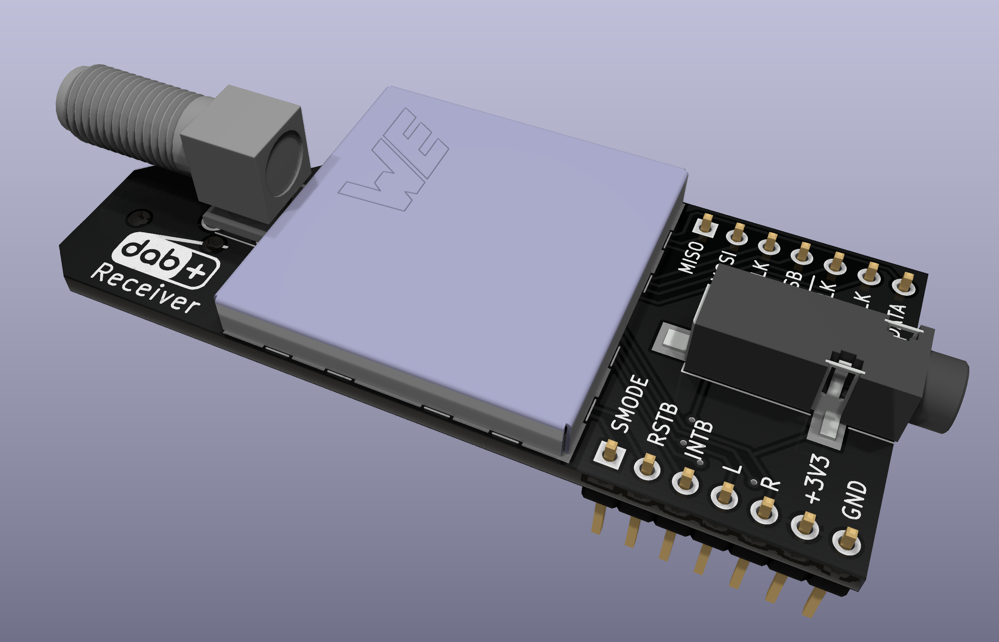

# DAB Breakout board

## Flash chip

Optionally a SST2VF016B-50-4C-S2AF Flash chip can be populated.

## Credits

- [3D model of the headphone jack](https://grabcad.com/library/3-5mm-audio-jack-1) by [Bilal](https://grabcad.com/bilal-72)
